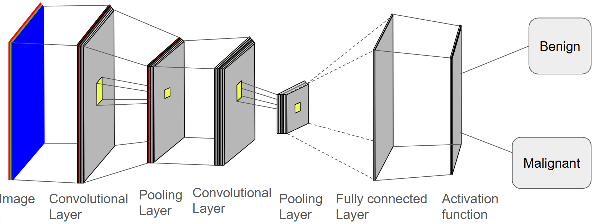
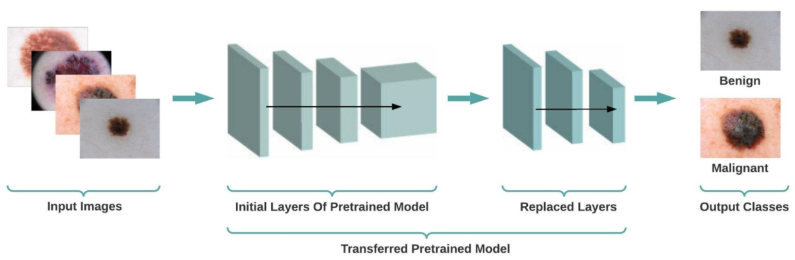
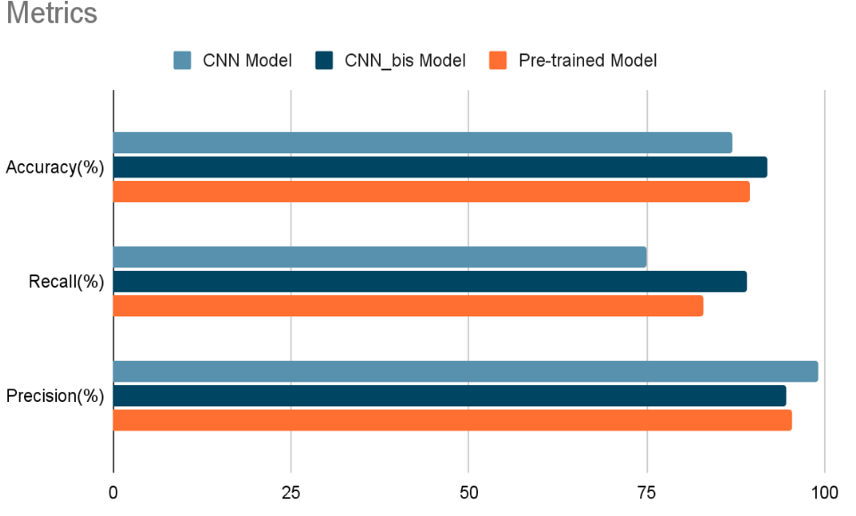

# Dermatology_app

 English version
  

This project is a study project conducted as part of the Data Science training given by Le Wagon #batch-1867

The Dermatology app project is an application for detecting melanoma criticality from a photo.

You can find the app [here](https://dermatologyappinterface2-vbraegs3uq4pkvjhgxvcw5.streamlit.app/)

## Is it a malignant melanoma ?

You can see two photos of melanoma.

Only ***one*** is malignant.
Not easy to spot the bad one, is it?

This app is here to help general practitioners who are not specialist in dermatology.
After using the app, practitioners can alert a dermatologist for further investigation if necessary.

## Modelisation

For this app, we use two Deep Learning models named CNN and a [pre-trained](https://huggingface.co/docs/transformers/main/en/model_doc/vit#vision-transformer-vit)  
All models are trained on a balanced dataset that you can find [here](https://www.kaggle.com/datasets/hasnainjaved/melanoma-skin-cancer-dataset-of-10000-images)

### CNN Model

The Convolutional Neural Networks or CNN is composed of multiple layer of neuron that is specialized in detecting patterns in images.  
There are 3 different types of layer :  

**1. Convolutional Layer**  
It's a filter which extract the feature of multiple pixel at the same time.  
For example, a convolutional layer 3x3 will perform the filter operation for every 3x3 pixel region of an image.

**2. Pooling Layer**  
This type of layer will reduce the complexity of a model by the reduction of the dimension of features maps.
For example, a max pooling 2x2 will take the maximum value for every 2x2 region of an image.

**3. Fully Connected Layer**  
It's the final layer. All the features of the last layer are extracted and combined.  
The results is a layer adapted for classification or regression requests.

### Pre-trained Model  

The pre-trained model is a model that has already been trained on a dataset.

## Results & metrics

Each models have results around 80%-90% in terms of accuracy, recall and precision :

 Version Française
  

Ce projet fait partie d'une formation de Data Science donnée par l'organisme Le Wagon #batch-1867  

Le projet dermatology app consiste en une interface permettant de détecter la criticité d'un mélanome à partir d'une image.  

L'interface est disponible [ici](https://dermatologyappinterface2-vbraegs3uq4pkvjhgxvcw5.streamlit.app/)

## Est-ce mélanome malin ?

Ci-dessous, 2 images de mélanome :  

Un **seul** est malin.
Pas évident de trouver lequel à l'oeil nu, non ?

Cette application est là pour aider les médecins généralistes qui ne sont pas des spécialistes en dermatologie.
Grâce à cette application, les gnéralistes pourront réorienter facilement le patient en cas de besoin vers un spécialiste pour un avis médical plus approfondi.

## Modelisation

Nous avons utilisé deux modèles de Deep Learning CNN et un model [pré-entraîné](https://huggingface.co/docs/transformers/main/en/model_doc/vit#vision-transformer-vit) pour créer cette interface.  
L'ensemble des modèles ont été entraîné par la suite sur ce [dataset](https://www.kaggle.com/datasets/hasnainjaved/melanoma-skin-cancer-dataset-of-10000-images)

### Modèle CNN

Le modèle de réseau de neurones convolutifs (CNN) est composé de plusieurs couches de neurones spécialisé dans la détection de motif récurrent dans une base de données constituée d'images.  
Il ya 3 types de couches neuronales :

**1. La couche de convolution**  
C'est un filtre qui permet d'extraire les caractéristiques de plusieurs pixels à la fois.  
Par exemple, une couche de convolution 3x3 fonctionne comme un filtre sur chaque zone formée de 3x3 pixels sur une image.

**2. La couche de Pooling**   
C'est une couche de neurones qui permet de simplifier le modèle en réduisant le nombre de caractéristiques total de l'image.  
Par exemple, un pooling max 2x2 va prendre uniquement la valeur maximal de chaque zone formée de 2x2 pixels sur une image.

**3. La couche entièrement connectée**  
C'est l'ultime couche avant la fonction d'activation.  
Toutes les caractéristiques de la couche précédente vont être extraites et combinées pour donner un ensemble de caractéristiques utilisable par la fonction d'activation.

### Pre-trained Model  
Le model pré-entraîné est un model qui a déjà été entraîné sur une autre base de données.

## Results & metrics

L'ensemble des modèles a des résultats autour de 80%-90% concernant l'accuracy, le recall et la précision :

